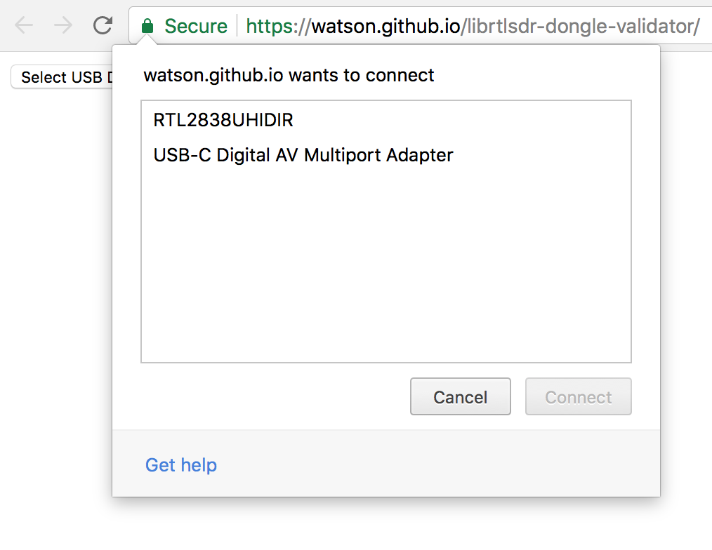
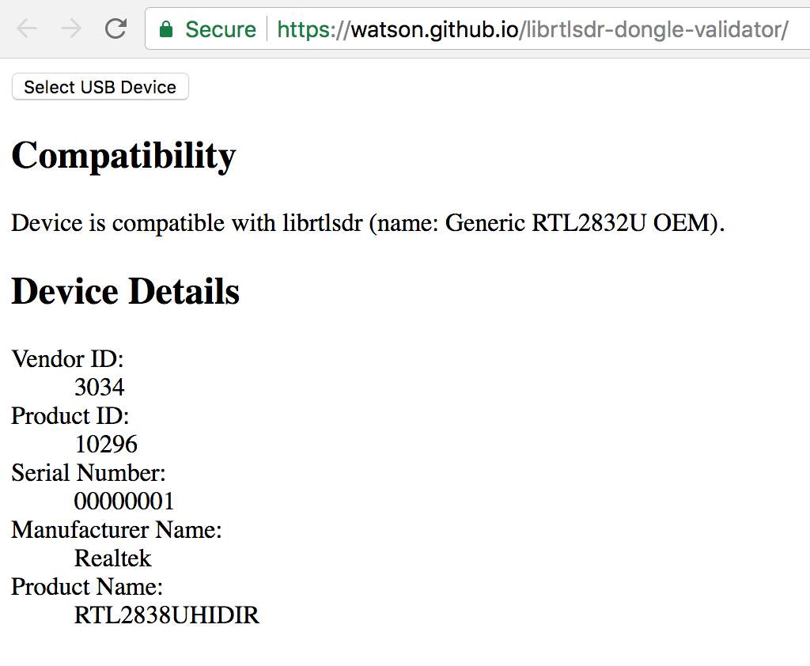

# librtlsdr-dongle-validator

A static website for testing USB device compatibility with the librtlsdr
library.

## Usage

1. Go to
   [https://watson.github.io/librtlsdr-dongle-validator/](https://watson.github.io/librtlsdr-dongle-validator/)
1. Plug in the RTL-SDR dongle you with to validate
1. Click the "Select USB Device" button
1. In the popup select the device you wish to validate and click
   "Connect"
   
1. You should now see the device details along with a message indicating
   if the device is compatible or not
   

## License

MIT
